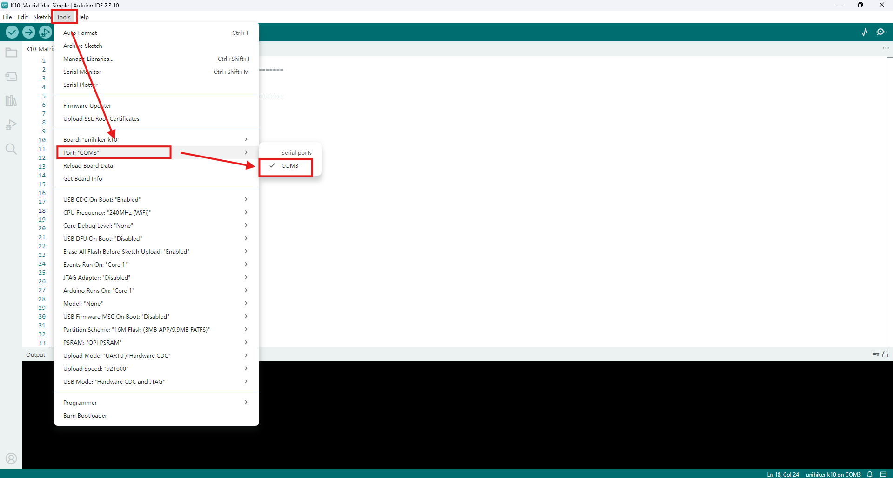
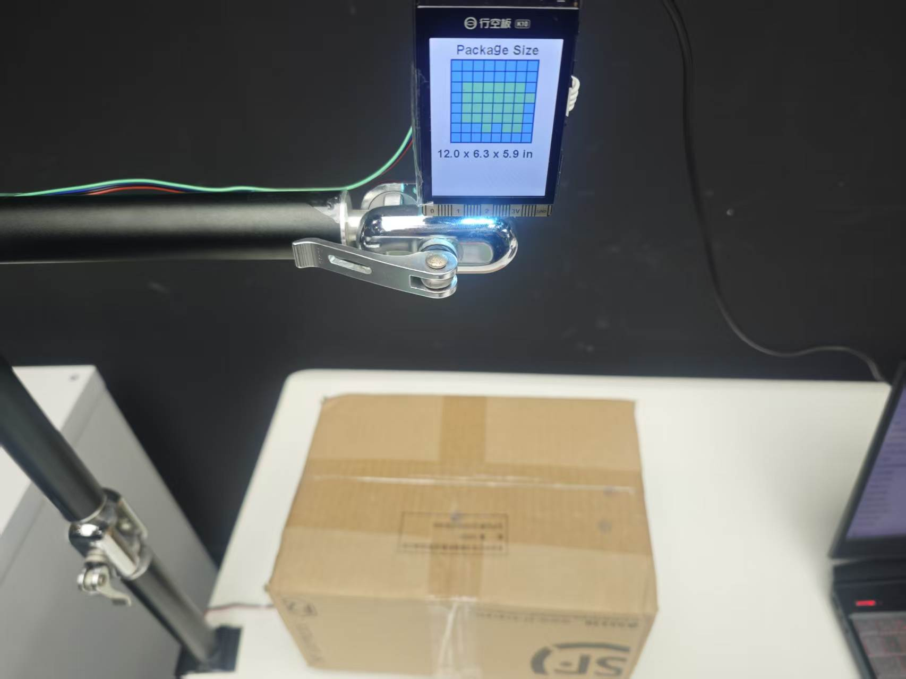
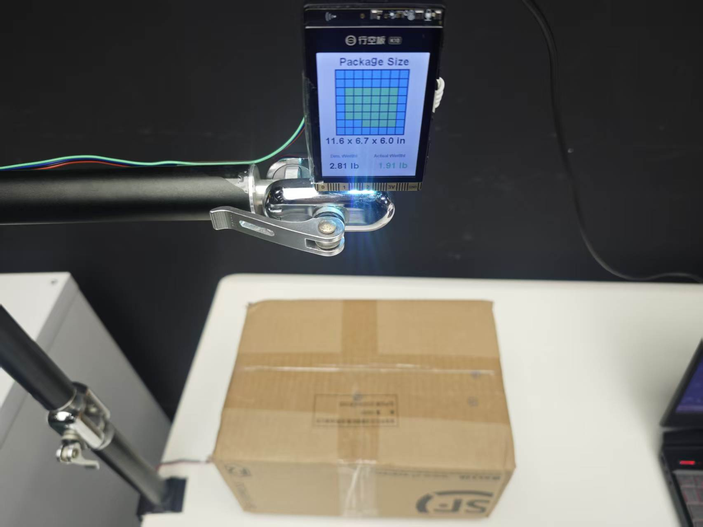

# Automated Delivery Billing System Based on 8x8 Lidar Distance Measurement

# 1\. Project Introduction

Have you ever noticed a scene like this in daily life? At a courier drop\-off point, staff often place parcels on an electronic scale to weigh them, then use a ruler to measure length, width, and height separately, and finally determine the billable weight based on dimensions and weight\. If many parcels arrive consecutively during peak shipping periods, repeatedly performing "weigh—measure—calculate" is not only time\-consuming but also prone to errors from manual readings\.

So I thought: could these steps be consolidated into a single device? Staff would only need to place the parcel on the detection platform, and the device would automatically obtain the parcel dimensions and weight, then use the results for subsequent billable weight and shipping cost estimation\.

This Project uses the **UNIHIKER UNIHIKER K10** as the Board, with a **matrix laser distance measurement Sensor** installed above the parcel\. It uses 64 distance measurement zones to determine the parcel's position and contour, then obtains the parcel's **length, width, and height** through background subtraction and geometric conversion\. A **weight Sensor** is added below the platform to obtain the actual weight\. Finally, the system combines the dimension and weight data to obtain volumetric weight and reference billable weight, and displays the results and estimates shipping costs through a web page\.


# 2\. Project Effect

[Automatic delivery system\.mp4](Images_attachments/Automatic%20delivery%20system.mp4)

# 三、项目制作准备

# 3\. Project Preparation

## Required Hardware

- [UNIHIKER UNIHIKER K10 \(UNIHIKER UNIHIKER K10\) \\\*1](https://www.dfrobot.com/product-2904.html)

- [SEN0628: Matrix Laser Distance Measurement Sensor \\\*1](https://www.dfrobot.com.cn/goods-4243.html)

- [HX711 Weight Sensor Kit \\\*1](https://wiki.dfrobot.com.cn/SKU%3Cem%3EKIT0176%3C/em%3EHX711%E9%87%8D%E9%87%8F%E4%BC%A0%E6%84%9F%E5%99%A8%E5%A5%97%E4%BB%B6)

- [I2C Extensions Module](https://wiki.dfrobot.com.cn/%3Cem%3EDFR0576%3C/em%3EGravity-I2C%3Cem%3EMultiplexer%3C/em%3EModule%3Cem%3EI2C%E6%89%A9%E5%B1%95%E6%A8%A1%E5%9D%97)

- PH2\\\.0\\\-4P data cable \\\*1 \(several Dupont wires\)

- USB TYPE\\\-C data cable \\\*1

## Wiring Connections

Use a 4\-pin cable to connect the I2C Extensions module to the I2C interface on the UNIHIKER K10\. Use Dupont wires to connect the 8×8 matrix laser distance measurement Sensor and the HX711 weight Sensor to the I2C Extensions module respectively\.


## Required Software

We need to first download and install [**Arduino IDE**](https://www.arduino.cc/en/software/), and complete the Arduino development environment configuration for the UNIHIKER UNIHIKER K10\. Only after installing the BSP corresponding to the UNIHIKER UNIHIKER K10 can the Arduino IDE recognize the UNIHIKER UNIHIKER K10 and complete program compilation and upload\. For the specific installation process, refer to: https://www\\\.unihiker\\\.com\\\.cn/wiki/k10/ArduinoIDE\\prepare

## Importing library

1. We also need to import the \**8\\*8 matrix laser distance measurement Sensor\*\* library file \(Attachment 1\), which provides the function to directly read 64\-point data\. The import method is: Sketch \(Project\) → Include Library \(Import library\) → Add \\\.ZIP Library \(Add \\\.ZIP library\)\.

2. Similarly, we also need to import the **weight Sensor** library file \(Attachment 2\)\. This library is used to complete communication between the UNIHIKER UNIHIKER K10 and the weight Sensor, and provides functions such as initialization, tare, and weight reading\.


# 4\. Project Production Steps


The entire Project implementation is designed around "how to automatically obtain the complete data needed for delivery billing\." The traditional approach usually requires manually using a tape measure to measure length, width, and height, then weighing separately\. This Project uses an 8×8 ToF depth matrix to obtain distance information for 64 zones at once, then combines the Sensor field of view and depth information to calculate length, width, and height\. Compared with single\-point laser distance measurement, it can obtain more complete spatial dimension information\. The weight Sensor is responsible for obtaining the parcel's actual weight\. The two types of Sensor respectively solve the problems of "how big is the parcel" and "how heavy is the parcel," and perform data fusion in the UNIHIKER UNIHIKER K10, calculating volumetric weight based on length, width, and height, then comparing it with the actual weight to obtain the billable weight\.

The UNIHIKER UNIHIKER K10 then sends the dimension and weight results to the web page through the USB serial port\. The web page uses the Web Serial API to read the data and provides fields for entering sender and recipient addresses, courier company information, etc\., then calculates the estimated shipping cost based on the billable weight and preset first\-weight, additional\-weight, and regional pricing rules\. The entire Project consists of "depth measurement—weight acquisition—data fusion—web interaction—shipping cost estimation," forming a complete workflow from automatic measurement to practical business application\.

## Phase 1: Parcel Dimension Measurement

We first use the distance measurement function of the 8×8 matrix laser distance measurement Sensor to obtain distance information for 64 positions within the measurement area\. The UNIHIKER UNIHIKER K10 then processes this depth data to determine the parcel's location and calculate length, width, and height\. To make the measurement process more intuitive, the UNIHIKER K10 screen also displays the 8×8 detection area and the currently measured dimensions in real time\. After completing this part, the system can automatically obtain the parcel's three\-dimensional dimensions without using a ruler\.


The entire dimension measurement is actually divided into two parts: height is obtained from the difference between the empty platform distance and the box top distance, while length and width are obtained from the parcel boundary position in the 8×8 depth map, combined with the field of view and box top distance for geometric projection\.

### Empty Scene Learning

Before placing a parcel, the system needs to perform an empty scene learning session to record the baseline distance from the Sensor to the empty platform\. After the program starts, the 8\\\*8 matrix laser distance measurement Sensor continuously collects multiple frames of depth data and records the distances for 64 measurement zones respectively, obtaining a relatively stable background depth through median processing\. After learning is complete, these 64 background distances serve as reference data for subsequently determining whether a parcel has appeared and calculating parcel height\.

```C++
// -------------------- Background Learning --------------------
void startBackgroundLearning() {
    backgroundReady = false;
    backgroundCount = 0;

    // Clear previous background data
    memset(backgroundDepth, 0, sizeof(backgroundDepth));
    memset(backgroundSamples, 0, sizeof(backgroundSamples));

    Serial.println("Starting background learning. Please keep the platform empty.");
}

// Continuously collect multiple frames of empty-platform depth data
void addBackgroundFrame(const uint16_t *frame) {
    if (backgroundCount >= BACKGROUND_FRAMES) return;

    uint8_t validCount = 0;

    for (uint8_t i = 0; i < ZONES; ++i) {
        backgroundSamples[backgroundCount][i] = frame[i];

        // Count only valid distance points
        if (validDistance(frame[i])) {
            ++validCount;
        }
    }

    // Keep this frame only when enough valid distance points are available
    if (validCount >= BACKGROUND_VALID_ZONES_MIN) {
        ++backgroundCount;
    }

    // Finish background learning after enough frames have been collected
    if (backgroundCount >= BACKGROUND_FRAMES) {
        finishBackgroundLearning();
    }
}
```

### Converting Depth Distance to Length, Width, and Height

After completing empty scene learning, place the parcel on the platform\. The system measures the distance from the Sensor to the top center of the parcel, for example 13\.8 in\. Compared with the previously learned empty platform distance of 500 mm, the parcel height can be directly obtained from the difference: 5\.9 in**\.**

Then, find the parcel's left, right, top, and bottom boundaries from the 8×8 depth data, and convert the boundary positions in the Sensor field of view into corresponding angles\. For example, the left and right boundaries relative to the center are approximately **\\\-15\\\.9° and 15\\\.9°**, and the box top center distance is 13\.8 in\. Using trigonometric projection, the width can be calculated as approximately 7\.9 in\. Similarly, when the top and bottom boundaries relative to the center are approximately **\\\-23\\\.2° and 23\\\.2°**, the length can be calculated as approximately 11\.8 in\.

```Markdown
wide = Ztop × (tanθR - tanθL)
   = 13.8 × [tan(15.9°) - tan(-15.9°)]
   ≈ 7.9 mm
   
Length = 13.8 × |tan(23.2°) - tan(-23.2°)|
     ≈ 13.8 × 0.8594
     ≈ 11.8 mm
```

### Quick Implementation

After the hardware connection is complete, connect the UNIHIKER K10 to the computer via USB cable, select the UNIHIKER UNIHIKER K10 as the development board in the Arduino IDE, select the corresponding serial port, then open the complete dimension measurement program and upload it\.




After uploading the code, click the right arrow icon to start running and uploading


**Complete Code for Dimension Measurement**

The program first extracts the parcel area based on the difference between background depth and current depth, and retains the largest connected component to reduce noise interference\. It then calculates the horizontal and vertical confidence distributions separately, and obtains the parcel's left, right, top, and bottom boundaries in the 8×8 grid through edge interpolation\. Combined with the Sensor's 60° field of view, the grid boundaries are converted into spatial angles, and the measured parcel top distance is used to calculate the actual length and width through trigonometric projection\. Parcel height is obtained from the difference between the empty platform background distance and the current parcel top distance\. Finally, the larger horizontal dimension is taken as length, the smaller as width, and the three measurement results of length, width, and height are output\.

```C++
#include <Arduino.h>
#include <math.h>
#include <string.h>
#include "unihiker_k10.h"
#include "DFRobot_MatrixLidar.h"

UNIHIKER_K10 k10;
DFRobot_MatrixLidar_I2C tof(0x33);

// ---------- Parameters ----------
constexpr uint8_t GRID=8, ZONES=64;
constexpr float FOV_X_DEG=60.0f, FOV_Y_DEG=60.0f;

// ---------- Dimension Calibration ----------
// Reference box size: 300 × 200 × 150 mm
// Current stable measurement: about 261 × 214 × 156 mm
// Correct only the final L/W/H values; keep background learning, foreground extraction, and the 8×8 display unchanged.
constexpr float LENGTH_SCALE = 300.0f / 261.0f; // ≈1.1494
constexpr float WIDTH_SCALE  = 200.0f / 214.0f; // ≈0.9346
constexpr float HEIGHT_SCALE = 150.0f / 156.0f; // ≈0.9615
constexpr uint16_t MIN_VALID_MM=20, MAX_VALID_MM=3900;

constexpr float FOREGROUND_START_MM=35.0f;
constexpr float FOREGROUND_FULL_MM=100.0f;
constexpr float MASK_LEVEL=0.35f;
constexpr float EDGE_MIN_LEVEL=0.50f, EDGE_FRACTION=0.60f;
constexpr uint8_t MIN_COMPONENT_ZONES=3;
constexpr float MIN_PACKAGE_HEIGHT_MM=45.0f;

constexpr uint8_t BACKGROUND_FRAMES=36;
constexpr uint8_t BACKGROUND_MIN_FRAMES=28;
constexpr uint8_t BACKGROUND_VALID_ZONES_MIN=40;
constexpr uint32_t BACKGROUND_TIMEOUT_MS=6000;

constexpr uint8_t DEPTH_FILTER_FRAMES=3;
constexpr uint8_t DETECT_CONFIRM_FRAMES=2;
constexpr uint8_t REMOVE_CONFIRM_FRAMES=4;
constexpr uint8_t MEASURE_FILTER_FRAMES=3;
constexpr uint32_t FRAME_INTERVAL_MS=60;
constexpr uint32_t DISPLAY_INTERVAL_MS=120;

constexpr uint8_t SCREEN_DIR=2;
constexpr int SCREEN_W=240, SCREEN_H=320;
constexpr int MAP_CELL=20, MAP_SIZE=MAP_CELL*GRID;
constexpr int MAP_X=(SCREEN_W-MAP_SIZE)/2, MAP_Y=40;

constexpr uint32_t C_BG=0xFFFFFF, C_PANEL=0xE8F0F7, C_BORDER=0xC5D3E0;
constexpr uint32_t C_TEXT=0x1F2937, C_MUTED=0x64748B;
constexpr uint32_t C_BLUE=0x24A7F2, C_GREEN=0x28D17C;
constexpr uint32_t C_DONE_GREEN=0x58E878, C_YELLOW=0xF4D447, C_RED=0xFF5B64;
constexpr uint32_t C_HEAT_FRAME=0x123A5B, C_HEAT_GRID=0x0A2B43;
constexpr bool ROTATE_MATRIX_180=true;

// ---------- Data ----------
uint16_t rawDepth[ZONES]={0}, filteredDepth[ZONES]={0}, backgroundDepth[ZONES]={0};
uint16_t backgroundSamples[BACKGROUND_FRAMES][ZONES]={{0}};
uint16_t depthHistory[DEPTH_FILTER_FRAMES][ZONES]={{0}};

uint8_t backgroundCount=0, historyCount=0, historyHead=0;
bool backgroundReady=false;
float learningProgressDisplay=0;
uint32_t backgroundLearningStartMs=0;

float confidenceMap[ZONES]={0};
bool componentMask[ZONES]={false};

struct Measurement{
  float lengthMm=0, widthMm=0, heightMm=0, distanceMm=0;
  uint8_t zoneCount=0;
  bool valid=false;
};

Measurement measurementHistory[MEASURE_FILTER_FRAMES], displayedMeasurement;
uint8_t measurementCount=0, measurementHead=0;
bool packagePresent=false;
uint8_t detectedFrames=0, emptyFrames=0;
uint32_t lastFrameMs=0, lastDisplayMs=0, lastSerialMs=0;
bool previousButtonA=false;

// ---------- Utilities ----------
bool validDistance(uint16_t mm){ return mm>=MIN_VALID_MM && mm<MAX_VALID_MM; }
float clamp01(float v){ return v<0?0:(v>1?1:v); }

float zoneAngleRad(uint8_t i,float fov){
  return (((i+0.5f)/GRID)-0.5f)*fov*DEG_TO_RAD;
}

float axialDistanceMm(uint16_t radial,uint8_t row,uint8_t col){
  float tx=tanf(zoneAngleRad(col,FOV_X_DEG));
  float ty=tanf(zoneAngleRad(row,FOV_Y_DEG));
  return radial/sqrtf(1.0f+tx*tx+ty*ty);
}

template<typename T>
void insertionSort(T *a,uint8_t n){
  for(uint8_t i=1;i<n;i++){
    T key=a[i]; int j=i-1;
    while(j>=0 && a[j]>key){ a[j+1]=a[j]; j--; }
    a[j+1]=key;
  }
}

float medianFloat(float *a,uint8_t n){
  if(!n) return 0;
  insertionSort(a,n);
  return (n&1)?a[n/2]:0.5f*(a[n/2-1]+a[n/2]);
}

uint16_t medianU16(uint16_t *a,uint8_t n){
  if(!n) return 0;
  insertionSort(a,n);
  return (n&1)?a[n/2]:(uint16_t)(((uint32_t)a[n/2-1]+a[n/2])/2);
}

uint8_t displayIndex(uint8_t row,uint8_t col){
  return ROTATE_MATRIX_180 ? (GRID-1-row)*GRID+(GRID-1-col) : row*GRID+col;
}

void setRgb(uint32_t c){ k10.rgb->setRangeColor(0,2,c); }

// ---------- Background Learning ----------
void resetMeasurementState(){
  packagePresent=false;
  detectedFrames=emptyFrames=measurementCount=measurementHead=0;
  displayedMeasurement=Measurement();
  memset(componentMask,0,sizeof(componentMask));
}

void startBackgroundLearning(){
  backgroundReady=false;
  backgroundCount=historyCount=historyHead=0;
  learningProgressDisplay=0;
  backgroundLearningStartMs=millis();
  memset(backgroundDepth,0,sizeof(backgroundDepth));
  memset(backgroundSamples,0,sizeof(backgroundSamples));
  memset(depthHistory,0,sizeof(depthHistory));
  resetMeasurementState();
  setRgb(C_YELLOW);
  Serial.println("Background learning started. Keep platform empty.");
}

void finishBackgroundLearning(){
  for(uint8_t z=0;z<ZONES;z++){
    uint16_t values[BACKGROUND_FRAMES];
    uint8_t n=0;
    for(uint8_t f=0;f<backgroundCount;f++){
      uint16_t v=backgroundSamples[f][z];
      if(validDistance(v)) values[n++]=v;
    }
    backgroundDepth[z]=(n>=BACKGROUND_FRAMES/2)?medianU16(values,n):0;
  }
  backgroundReady=true;
  historyCount=historyHead=0;
  setRgb(C_BLUE);
  Serial.println("Background learning complete.");
}

void addBackgroundFrame(const uint16_t *frame){
  if(backgroundCount>=BACKGROUND_FRAMES) return;

  uint8_t valid=0;
  for(uint8_t i=0;i<ZONES;i++){
    backgroundSamples[backgroundCount][i]=frame[i];
    if(validDistance(frame[i])) valid++;
  }
  if(valid>=BACKGROUND_VALID_ZONES_MIN) backgroundCount++;

  if(backgroundCount>=BACKGROUND_FRAMES){
    finishBackgroundLearning();
  }else if(millis()-backgroundLearningStartMs>=BACKGROUND_TIMEOUT_MS &&
           backgroundCount>=BACKGROUND_MIN_FRAMES){
    finishBackgroundLearning();
  }
}

// ---------- Depth Filtering ----------
void updateDepthMedian(const uint16_t *frame){
  memcpy(depthHistory[historyHead],frame,sizeof(uint16_t)*ZONES);
  historyHead=(historyHead+1)%DEPTH_FILTER_FRAMES;
  if(historyCount<DEPTH_FILTER_FRAMES) historyCount++;

  for(uint8_t z=0;z<ZONES;z++){
    uint16_t values[DEPTH_FILTER_FRAMES];
    uint8_t n=0;
    for(uint8_t h=0;h<historyCount;h++){
      uint16_t v=depthHistory[h][z];
      if(validDistance(v)) values[n++]=v;
    }
    filteredDepth[z]=medianU16(values,n);
  }
}

// ---------- Foreground Extraction ----------
void buildConfidenceMap(){
  for(uint8_t row=0;row<GRID;row++){
    for(uint8_t col=0;col<GRID;col++){
      uint8_t i=row*GRID+col;
      if(!validDistance(backgroundDepth[i]) || !validDistance(filteredDepth[i])){
        confidenceMap[i]=0;
        continue;
      }
      float bg=axialDistanceMm(backgroundDepth[i],row,col);
      float now=axialDistanceMm(filteredDepth[i],row,col);
      confidenceMap[i]=clamp01((bg-now-FOREGROUND_START_MM)/
                               (FOREGROUND_FULL_MM-FOREGROUND_START_MM));
    }
  }
}

uint8_t keepLargestComponent(){
  bool visited[ZONES]={false}, best[ZONES]={false};
  uint8_t bestCount=0;
  const int dr[8]={-1,-1,-1,0,0,1,1,1};
  const int dc[8]={-1,0,1,-1,1,-1,0,1};

  for(uint8_t seed=0;seed<ZONES;seed++){
    if(visited[seed] || confidenceMap[seed]<MASK_LEVEL) continue;

    uint8_t q[ZONES], members[ZONES], head=0, tail=0, count=0;
    q[tail++]=seed; visited[seed]=true;

    while(head<tail){
      uint8_t cur=q[head++];
      members[count++]=cur;
      int row=cur/GRID, col=cur%GRID;

      for(uint8_t n=0;n<8;n++){
        int nr=row+dr[n], nc=col+dc[n];
        if(nr<0 || nr>=GRID || nc<0 || nc>=GRID) continue;
        uint8_t next=nr*GRID+nc;
        if(!visited[next] && confidenceMap[next]>=MASK_LEVEL){
          visited[next]=true;
          q[tail++]=next;
        }
      }
    }

    if(count>bestCount){
      memset(best,0,sizeof(best));
      for(uint8_t i=0;i<count;i++) best[members[i]]=true;
      bestCount=count;
    }
  }

  memcpy(componentMask,best,sizeof(componentMask));
  return bestCount;
}

bool profileEdges(const float p[GRID],float &left,float &right){
  float peak=0;
  for(uint8_t i=0;i<GRID;i++) peak=max(peak,p[i]);
  if(peak<EDGE_MIN_LEVEL) return false;

  float level=max(EDGE_MIN_LEVEL,peak*EDGE_FRACTION);
  int first=-1,last=-1;
  for(uint8_t i=0;i<GRID;i++){
    if(p[i]>=level){ if(first<0) first=i; last=i; }
  }
  if(first<0) return false;

  float inX=first+0.5f, outX=first-0.5f;
  float inV=p[first], outV=first>0?p[first-1]:0;
  float den=inV-outV;
  left=fabsf(den)>0.0001f ? outX+(level-outV)/den : (float)first;

  inX=last+0.5f; outX=last+1.5f;
  inV=p[last]; outV=last<GRID-1?p[last+1]:0;
  den=outV-inV;
  right=fabsf(den)>0.0001f ? inX+(level-inV)/den : (float)(last+1);

  left=constrain(left,0.0f,(float)GRID);
  right=constrain(right,0.0f,(float)GRID);
  return right>left;
}

float gridBoundaryAngle(float b,float fov){
  return ((b/GRID)-0.5f)*fov*DEG_TO_RAD;
}

// ---------- Length / Width / Height ----------
Measurement analyzeForeground(){
  Measurement r;
  buildConfidenceMap();
  uint8_t zones=keepLargestComponent();
  if(zones<MIN_COMPONENT_ZONES) return r;

  float colP[GRID]={0}, rowP[GRID]={0};
  float allZ[ZONES], allH[ZONES], allR[ZONES];
  float coreZ[ZONES], coreH[ZONES], coreR[ZONES];
  uint8_t allN=0, coreN=0;

  for(uint8_t row=0;row<GRID;row++){
    for(uint8_t col=0;col<GRID;col++){
      uint8_t i=row*GRID+col;
      if(!componentMask[i]) continue;

      float c=confidenceMap[i];
      colP[col]+=c; rowP[row]+=c;

      float z=axialDistanceMm(filteredDepth[i],row,col);
      float bg=axialDistanceMm(backgroundDepth[i],row,col);
      float h=bg-z;

      allZ[allN]=z; allH[allN]=h; allR[allN]=filteredDepth[i]; allN++;
      if(c>=0.72f){
        coreZ[coreN]=z; coreH[coreN]=h; coreR[coreN]=filteredDepth[i]; coreN++;
      }
    }
  }
  if(!allN) return r;

  float maxCol=0,maxRow=0;
  for(uint8_t i=0;i<GRID;i++){
    maxCol=max(maxCol,colP[i]);
    maxRow=max(maxRow,rowP[i]);
  }
  if(maxCol<=0.0001f || maxRow<=0.0001f) return r;

  for(uint8_t i=0;i<GRID;i++){ colP[i]/=maxCol; rowP[i]/=maxRow; }

  float left,right,top,bottom;
  if(!profileEdges(colP,left,right) || !profileEdges(rowP,top,bottom)) return r;

  bool useCore=coreN>=2;
  float topZ=useCore?medianFloat(coreZ,coreN):medianFloat(allZ,allN);
  float height=useCore?medianFloat(coreH,coreN):medianFloat(allH,allN);
  float radial=useCore?medianFloat(coreR,coreN):medianFloat(allR,allN);
  if(topZ<=0 || height<MIN_PACKAGE_HEIGHT_MM) return r;

  float aL=gridBoundaryAngle(left,FOV_X_DEG);
  float aR=gridBoundaryAngle(right,FOV_X_DEG);
  float aT=gridBoundaryAngle(top,FOV_Y_DEG);
  float aB=gridBoundaryAngle(bottom,FOV_Y_DEG);

  float x=topZ*fabsf(tanf(aR)-tanf(aL));
  float y=topZ*fabsf(tanf(aB)-tanf(aT));

  // Raw geometric result
  const float rawLength=max(x,y);
  const float rawWidth=min(x,y);

  // Apply three-axis calibration for the current fixed installation
  r.lengthMm=rawLength*LENGTH_SCALE;
  r.widthMm=rawWidth*WIDTH_SCALE;
  r.heightMm=height*HEIGHT_SCALE;
  r.distanceMm=radial;
  r.zoneCount=zones;
  r.valid=r.lengthMm>=20.0f && r.widthMm>=20.0f;
  return r;
}

void addMeasurement(const Measurement &m){
  if(displayedMeasurement.valid &&
     (fabsf(m.lengthMm-displayedMeasurement.lengthMm)>45 ||
      fabsf(m.widthMm-displayedMeasurement.widthMm)>45 ||
      fabsf(m.heightMm-displayedMeasurement.heightMm)>35)){
    measurementCount=measurementHead=0;
  }

  measurementHistory[measurementHead]=m;
  measurementHead=(measurementHead+1)%MEASURE_FILTER_FRAMES;
  if(measurementCount<MEASURE_FILTER_FRAMES) measurementCount++;

  float L[MEASURE_FILTER_FRAMES],W[MEASURE_FILTER_FRAMES];
  float H[MEASURE_FILTER_FRAMES],D[MEASURE_FILTER_FRAMES];
  for(uint8_t i=0;i<measurementCount;i++){
    L[i]=measurementHistory[i].lengthMm;
    W[i]=measurementHistory[i].widthMm;
    H[i]=measurementHistory[i].heightMm;
    D[i]=measurementHistory[i].distanceMm;
  }

  float l=medianFloat(L,measurementCount);
  float w=medianFloat(W,measurementCount);
  float h=medianFloat(H,measurementCount);
  float d=medianFloat(D,measurementCount);

  if(!displayedMeasurement.valid){
    displayedMeasurement.lengthMm=l;
    displayedMeasurement.widthMm=w;
    displayedMeasurement.heightMm=h;
    displayedMeasurement.distanceMm=d;
  }else{
    if(fabsf(l-displayedMeasurement.lengthMm)>2.5f)
      displayedMeasurement.lengthMm=0.35f*displayedMeasurement.lengthMm+0.65f*l;
    if(fabsf(w-displayedMeasurement.widthMm)>2.5f)
      displayedMeasurement.widthMm=0.35f*displayedMeasurement.widthMm+0.65f*w;
    if(fabsf(h-displayedMeasurement.heightMm)>2.0f)
      displayedMeasurement.heightMm=0.30f*displayedMeasurement.heightMm+0.70f*h;
    if(fabsf(d-displayedMeasurement.distanceMm)>2.0f)
      displayedMeasurement.distanceMm=0.35f*displayedMeasurement.distanceMm+0.65f*d;
  }

  displayedMeasurement.zoneCount=m.zoneCount;
  displayedMeasurement.valid=true;
}

void updatePresenceState(const Measurement &m){
  if(m.valid){
    emptyFrames=0;
    if(detectedFrames<DETECT_CONFIRM_FRAMES) detectedFrames++;
    if(!packagePresent) setRgb(C_YELLOW);

    if(detectedFrames>=DETECT_CONFIRM_FRAMES){
      if(!packagePresent){
        packagePresent=true;
        measurementCount=measurementHead=0;
        setRgb(C_GREEN);
      }
      addMeasurement(m);
    }
  }else{
    detectedFrames=0;
    if(packagePresent){
      if(emptyFrames<REMOVE_CONFIRM_FRAMES) emptyFrames++;
      if(emptyFrames>=REMOVE_CONFIRM_FRAMES){
        resetMeasurementState();
        setRgb(C_BLUE);
      }
    }else setRgb(C_BLUE);
  }
}

// ---------- UI ----------
void fillScreen(uint32_t c){
  k10.canvas->canvasRectangle(0,0,SCREEN_W,SCREEN_H,c,c,true);
}

void drawText(const String &s,int x,int y,uint32_t c,
              Canvas::eFontSize_t font=Canvas::eCNAndENFont16){
  k10.canvas->canvasText(s,x,y,c,font,30,false);
}

String inch(float mm){ return String(mm/25.4f,1); }

uint32_t matrixCellColor(uint8_t i){
  if(!packagePresent && detectedFrames==0) return C_BLUE;
  if(!packagePresent) return componentMask[i]?C_YELLOW:C_BLUE;
  return componentMask[i]?C_DONE_GREEN:C_BLUE;
}

void drawStateMatrix(){
  k10.canvas->canvasSetLineWidth(1);
  k10.canvas->canvasRectangle(MAP_X-2,MAP_Y-2,MAP_SIZE+4,MAP_SIZE+4,
                              C_HEAT_FRAME,C_HEAT_FRAME,true);

  for(uint8_t row=0;row<GRID;row++){
    for(uint8_t col=0;col<GRID;col++){
      uint8_t i=displayIndex(row,col);
      int x=MAP_X+col*MAP_CELL, y=MAP_Y+row*MAP_CELL;
      uint32_t c=matrixCellColor(i);
      k10.canvas->canvasRectangle(x,y,MAP_CELL,MAP_CELL,C_HEAT_GRID,C_HEAT_GRID,true);
      k10.canvas->canvasRectangle(x+1,y+1,MAP_CELL-2,MAP_CELL-2,c,c,true);
    }
  }
}

void drawLearningScreen(){
  fillScreen(C_BG);
  drawText("Learning",76,72,C_BLUE,Canvas::eCNAndENFont24);
  drawText("Keep platform empty",39,132,C_MUTED);

  float target=backgroundCount*100.0f/BACKGROUND_FRAMES;
  learningProgressDisplay+=(target-learningProgressDisplay)*0.32f;
  if(fabsf(target-learningProgressDisplay)<0.2f) learningProgressDisplay=target;
  int p=constrain((int)(learningProgressDisplay+0.5f),0,100);

  k10.canvas->canvasRectangle(32,190,176,14,C_BORDER,C_PANEL,true);
  k10.canvas->canvasRectangle(34,192,172*p/100,10,C_BLUE,C_BLUE,true);
  drawText(String(p)+"%",p>=100?86:94,220,C_TEXT,Canvas::eCNAndENFont24);
  k10.canvas->updateCanvas();
}

void drawMainScreen(){
  if(lastDisplayMs && millis()-lastDisplayMs<DISPLAY_INTERVAL_MS) return;
  lastDisplayMs=millis();

  fillScreen(C_BG);
  drawText("Package Size",48,7,C_TEXT,Canvas::eCNAndENFont24);
  drawStateMatrix();

  String s="-- x -- x -- in";
  if(packagePresent && displayedMeasurement.valid){
    s=inch(displayedMeasurement.lengthMm)+" x "+
      inch(displayedMeasurement.widthMm)+" x "+
      inch(displayedMeasurement.heightMm)+" in";
  }
  int x=s.length()<=16?22:(s.length()<=20?12:6);
  drawText(s,x,210,C_TEXT,Canvas::eCNAndENFont24);
  k10.canvas->updateCanvas();
}

void drawSensorError(){
  fillScreen(C_BG);
  drawText("Sensor Error",48,82,C_RED,Canvas::eCNAndENFont24);
  drawText("SEN0628 not found",45,142,C_TEXT);
  drawText("Check I2C wiring",50,178,C_MUTED);
  k10.canvas->updateCanvas();
}

void handleButtonA(){
  bool a=k10.buttonA->isPressed();
  if(a && !previousButtonA) startBackgroundLearning();
  previousButtonA=a;
}

// ---------- Serial Output ----------
void printDiagnostics(const Measurement &m){
  if(millis()-lastSerialMs<500) return;
  lastSerialMs=millis();

  Serial.print("state=");
  Serial.print(!backgroundReady?"LEARNING":(packagePresent?"PRESENT":"WAITING"));
  Serial.print(" zones=");
  Serial.print(m.zoneCount);
  Serial.print(" L/W/H(mm)=");

  if(displayedMeasurement.valid){
    Serial.print(displayedMeasurement.lengthMm,1); Serial.print("/");
    Serial.print(displayedMeasurement.widthMm,1);  Serial.print("/");
    Serial.println(displayedMeasurement.heightMm,1);
  }else{
    Serial.println("--/--/--");
  }
}

// ---------- Initialization ----------
void setup(){
  Serial.begin(115200);
  delay(1000);

  k10.begin();
  k10.initScreen(SCREEN_DIR);
  k10.creatCanvas();
  k10.setScreenBackground(C_BG);
  k10.rgb->brightness(20);

  fillScreen(C_BG);
  drawText("Connecting sensor",26,120,C_BLUE,Canvas::eCNAndENFont24);
  k10.canvas->updateCanvas();

  int r=tof.begin();
  Serial.print("tof.begin result = "); Serial.println(r);
  if(r!=0){
    drawSensorError();
    while(1) delay(100);
  }

  r=tof.setRangingMode(eMatrix_8X8);
  Serial.print("setRangingMode result = "); Serial.println(r);
  if(r!=0){
    drawSensorError();
    while(1) delay(100);
  }

  Serial.println("SEN0628 8x8 ready.");
  delay(300);
  startBackgroundLearning();
}

// ---------- Main Loop ----------
void loop(){
  handleButtonA();

  uint32_t now=millis();
  if(now-lastFrameMs<FRAME_INTERVAL_MS){ delay(2); return; }
  lastFrameMs=now;

  if(tof.getAllData(rawDepth)!=0){
    Serial.println("getAllData failed");
    delay(20);
    return;
  }

  if(!backgroundReady){
    addBackgroundFrame(rawDepth);
    drawLearningScreen();
    return;
  }

  updateDepthMedian(rawDepth);

  Measurement current;
  if(historyCount>=DEPTH_FILTER_FRAMES) current=analyzeForeground();

  updatePresenceState(current);
  drawMainScreen();
  printDiagnostics(current);
}

```

### Running Results 

Based on the data measured by the 8x8 Matrix ToF 3D Distance Sensor, the depth distance converted to length, width, and height is \(12\.0 in x 6\.3 in x 5\.9 in\)\. The actual dimensions of the package are \(11\.8 in x 7\.9 in x 5\.9 in\), both maintaining minimal error, demonstrating real\-world reliability\.



## Phase 2: Adding Weight Detection Previously

the 8x8 Matrix ToF 3D Distance Sensor was used to complete automatic measurement of the package's length, width, and height\. However, in the actual shipping process, dimension data alone is not enough to determine the final billable weight\. This is because shipping billing typically also requires considering the actual weight of the package\. For packages that are large in volume but light in weight, volumetric weight may also be used for calculation\. Therefore, the next step is to add weight detection on top of the existing dimension measurement functionality, allowing the UNIHIKER K10 to obtain the actual weight of the package while measuring length, width, and height, and then combine the dimension and weight data to complete the calculation of volumetric weight and billable weight\.


The weight detection part uses an I2C weight sensor\. After the program starts, it first completes sensor initialization and no\-load tare, then periodically reads weight data\. Considering that the scale platform is affected by mechanical vibration and sensor noise, a single reading is prone to fluctuation\. Therefore, the program first takes multiple samples from the sensor, then uses a 5\-point median filter to remove instantaneous outliers, and also sets a zero dead zone to directly zero out fluctuations less than 5 g, thereby obtaining a more stable actual weight\. 

Weight sensor code:

```C++
// -------------------- Weight Sensor Initialization --------------------
void initializeScale() {
    // Initialize the HX711 I2C weight sensor
    scaleConnected = scaleI2C.begin();

    if (!scaleConnected) {
        Serial.println("HX711 not detected");
        return;
    }

    // Set the calibration factor and tare the empty platform
    scaleI2C.setCalibration(HX711_CALIBRATION_VALUE);
    scaleI2C.peel();

    // Reset the weight filter state
    resetWeightFilterState();

    Serial.println("HX711 I2C ready and tared.");
}

// -------------------- Weight Reading --------------------
void updateWeight() {
    if (!scaleConnected) return;

    // Read the weight 4 times and use the sensor's internal average
    float grams = fabsf(scaleI2C.readWeight(4));

    // Treat values below 5 g as zero-point noise
    if (grams < WEIGHT_ZERO_BAND_G) {
        grams = 0.0f;
    }

    // Store the value in the history window for median filtering
    weightHistoryG[weightHistoryHead] = grams;
    weightHistoryHead =
        (weightHistoryHead + 1) % WEIGHT_MEDIAN_WINDOW;

    if (weightHistoryCount < WEIGHT_MEDIAN_WINDOW) {
        ++weightHistoryCount;
    }

    // Get the robust weight value after removing outliers
    const float robustG = robustWeightMedian();
}
```

n actual express shipping billing, there are volumetric weight and actual weight\. The volumetric weight is obtained by first converting the measured package "length, width, height" units into feet, then calculating the package volume \(unit: in3\), then dividing the package volume by the volumetric divisor 166, and then comparing it with the actual weight of the package \(unit: lb\), taking the larger one as the billable weight, and then rounding up according to the set billing rules\. 

Billable weight source code:

```C++
// Convert the actual weight from grams to pounds.
const float actualWeightLb =
    max(0.0f, filteredWeightG) /
    453.59237f;

// Convert measured dimensions from millimeters to inches.
const float lengthIn =
    displayedMeasurement.lengthMm /
    25.4f;

const float widthIn =
    displayedMeasurement.widthMm /
    25.4f;

const float heightIn =
    displayedMeasurement.heightMm /
    25.4f;

// Round each dimension up to the next whole inch
// for dimensional-weight calculation.
const float billingLengthIn = ceilf(lengthIn);
const float billingWidthIn  = ceilf(widthIn);
const float billingHeightIn = ceilf(heightIn);

// Calculate dimensional weight using
// the 139 in³/lb divisor.
const float rawDimensionalWeightLb =
    (billingLengthIn *
     billingWidthIn *
     billingHeightIn) /
    139.0f;

// Round dimensional weight up to the next whole pound.
displayedVolumeWeightLb =
    ceilf(rawDimensionalWeightLb);

// Round actual weight up to the next whole pound.
const float billingActualWeightLb =
    ceilf(actualWeightLb);

// Use the greater of actual weight
// and dimensional weight.
displayedChargeableLb =
    max(
        billingActualWeightLb,
        displayedVolumeWeightLb
    );
```

**Running Results**

After adding the weight sensor, the measured actual weight of the package is 1\.91 lb, while the measured package dimension data is \(11\.6 in x 6\.7 in x 6\.0 in\) \(each measurement may have slight fluctuations due to different placement positions, but this does not affect the final estimated charge\)\. Therefore, the volumetric weight is \(11\.6 x 6\.7 x 6 / 166\) = 2\.81 lb\.



## Phase 3: Estimating Shipping Price via Webpage 

We have completed the automatic collection of the package's length, width, height, and actual weight, and the UNIHIKER K10 can also directly display the measurement results on the screen\. In actual express shipping, it is also necessary to fill in sender and recipient information, select a courier company, and further estimate the shipping fee based on package dimensions and weight\. Therefore, after completing dimension and weight detection, I used HTML, CSS, and JavaScript to add a real\-time webpage\. The data collected by the UNIHIKER K10 is sent to the computer via USB serial, and the webpage uses the browser's Web Serial API to directly read and parse the serial data, then displays the measurement results in real time on the page\. The user then fills in the sender and recipient addresses and selects a courier company, and the webpage matches preset first\-weight, additional\-weight, and regional pricing rules based on the billable weight to calculate the estimated shipping fee\.


We can download the HTML file \(Attachment 3\), double\-click to open it, then click serial connection \(at this time, the serial port in the Arduino IDE must be closed\), and then the real\-time data from the UNIHIKER K10 will be displayed on this interface\. Then we can fill in the sender and recipient addresses and user information, and select the courier carrier and service mode\.


## Phase 4: Obtaining the Estimated Price

Based on the regular shipping quotes published by common courier company platforms, a corresponding price table is created, corresponding to different charging standards, using the first\-weight \+ additional\-weight standard, with the first weight being 1KG\. When the first weight is exceeded, the additional weight is charged\. The additional weight fee varies depending on different carriers and the distance between the sender and recipient addresses\. Any additional weight less than 1KG is calculated as 1KG\. When the user selects the courier company to ship with, the system automatically calculates the corresponding estimated quote\.


The current Project is mainly used for prototype verification, so a local price table is used to simulate quotations\. In the future, it can be further integrated with courier companies' official interfaces or third\-party logistics APIs to enable real shipping cost queries and order placement\. This extends the entire Project from "automatic measurement" to a complete workflow of "measurement \+ information entry \+ shipping cost estimation\."


## Complete Code 

You can also implement the entire functionality based on the complete code below \(or download Attachment 4\)\!

```C++
#include <Arduino.h>
#include <Wire.h>
#include <math.h>
#include <string.h>
#include "unihiker_k10.h"
#include "DFRobot_MatrixLidar.h"
#include "DFRobot_HX711_I2C.h"

UNIHIKER_K10 k10;

// -------------------- Hardware Parameters --------------------
static constexpr uint8_t HX711_I2C_ADDRESS = 0x64;

// Calibration value for the HX711 I2C module.
static constexpr float HX711_CALIBRATION_VALUE = 2236.0f;
static constexpr float WEIGHT_ZERO_BAND_G = 5.0f;

// -------------------- Weight Rules --------------------
// Dimensional weight: kg = L(cm) x W(cm) x H(cm) / 6000.
// Chargeable weight uses the larger of actual and dimensional weight, rounded up to 0.5 kg.
// Shipping cost is calculated by the web interface, not by the K10.
static constexpr float VOLUME_DIVISOR = 6000.0f;
static constexpr float CHARGE_UNIT_KG = 0.5f;
static constexpr float WEIGHT_STABLE_DELTA_G = 3.0f;
static constexpr uint8_t WEIGHT_STABLE_FRAMES = 4;
static constexpr uint32_t WEIGHT_READ_INTERVAL_MS = 100;
static constexpr uint8_t WEIGHT_MEDIAN_WINDOW = 5;
static constexpr float WEIGHT_FAST_JUMP_G = 35.0f;
static constexpr float WEIGHT_MEDIUM_JUMP_G = 10.0f;
static constexpr float WEIGHT_FAST_ALPHA = 0.78f;
static constexpr float WEIGHT_MEDIUM_ALPHA = 0.48f;
static constexpr float WEIGHT_SLOW_ALPHA = 0.22f;
static constexpr float WEIGHT_LOCK_BAND_G = 8.0f;

// Verified SEN0628 I2C address: 0x33.
DFRobot_MatrixLidar_I2C tof(0x33);

// -------------------- Depth and Geometry Parameters --------------------
static constexpr uint8_t GRID = 8;
static constexpr uint8_t ZONES = GRID * GRID;
static constexpr float FOV_X_DEG = 60.0f;
static constexpr float FOV_Y_DEG = 60.0f;

// -------------------- Dimension Calibration --------------------
// Reference box size: 300 x 200 x 150 mm.
// Current stable raw measurement: about 261 x 214 x 156 mm.
// Correct only final L/W/H values; detection logic remains unchanged.
static constexpr float LENGTH_CALIBRATION = 300.0f / 261.0f;
static constexpr float WIDTH_CALIBRATION  = 200.0f / 214.0f;
static constexpr float HEIGHT_CALIBRATION = 150.0f / 156.0f;

static constexpr uint16_t MIN_VALID_MM = 20;
static constexpr uint16_t MAX_VALID_MM = 3900;
static constexpr float FOREGROUND_START_MM = 35.0f;
static constexpr float FOREGROUND_FULL_MM  = 100.0f;
static constexpr float MASK_LEVEL = 0.35f;
static constexpr float EDGE_MIN_LEVEL = 0.50f;
static constexpr float EDGE_FRACTION = 0.60f;
static constexpr uint8_t MIN_COMPONENT_ZONES = 3;
static constexpr float MIN_PACKAGE_HEIGHT_MM = 45.0f;

static constexpr uint8_t BACKGROUND_FRAMES = 36;
static constexpr uint8_t BACKGROUND_MIN_FRAMES = 28;
static constexpr uint8_t BACKGROUND_VALID_ZONES_MIN = 40;
static constexpr uint32_t BACKGROUND_TIMEOUT_MS = 6000;
static constexpr uint8_t DEPTH_FILTER_FRAMES = 3;
static constexpr uint8_t DETECT_CONFIRM_FRAMES = 2;
static constexpr uint8_t REMOVE_CONFIRM_FRAMES = 4;
static constexpr uint8_t MEASURE_FILTER_FRAMES = 3;
static constexpr uint32_t FRAME_INTERVAL_MS = 60;
static constexpr uint32_t DISPLAY_INTERVAL_MS = 120;

// Rotate only the 8x8 display if required by the mounting orientation.
static constexpr bool ROTATE_MATRIX_180 = true;

// -------------------- Display Parameters --------------------
static constexpr uint8_t SCREEN_DIR = 2;
static constexpr int SCREEN_W = 240;
static constexpr int SCREEN_H = 320;
static constexpr int MAP_CELL = 20;
static constexpr int MAP_SIZE = MAP_CELL * GRID;
static constexpr int MAP_X = (SCREEN_W - MAP_SIZE) / 2;
static constexpr int MAP_Y = 40;

static constexpr uint32_t C_BG       = 0xFFFFFF;
static constexpr uint32_t C_HEADER   = 0xFFFFFF;
static constexpr uint32_t C_PANEL    = 0xE8F0F7;
static constexpr uint32_t C_BORDER   = 0xC5D3E0;
static constexpr uint32_t C_TEXT     = 0x1F2937;
static constexpr uint32_t C_MUTED    = 0x64748B;
static constexpr uint32_t C_GRID     = 0x149FE6;
static constexpr uint32_t C_BLUE     = 0x24A7F2;
static constexpr uint32_t C_GREEN    = 0x28D17C;
static constexpr uint32_t C_DONE_GREEN = 0x58E878;
static constexpr uint32_t C_YELLOW   = 0xF4D447;
static constexpr uint32_t C_RED      = 0xFF5B64;
static constexpr uint32_t C_INVALID  = 0x12486B;
static constexpr uint32_t C_HEAT_FRAME = 0x123A5B;
static constexpr uint32_t C_HEAT_GRID = 0x0A2B43;

DFRobot_HX711_I2C scaleI2C(&Wire, HX711_I2C_ADDRESS);
bool scaleConnected = false;
float filteredWeightG = 0.0f;
float previousWeightG = 0.0f;
float previousRobustWeightG = 0.0f;
float stableWeightG = 0.0f;
float weightHistoryG[WEIGHT_MEDIAN_WINDOW] = {0};
uint8_t weightHistoryCount = 0;
uint8_t weightHistoryHead = 0;
uint8_t weightStableFrames = 0;
bool weightLocked = false;
float displayedChargeableKg = 0.0f;
float displayedVolumeWeightKg = 0.0f;

// -------------------- Data and State --------------------
uint16_t rawDepth[ZONES] = {0};
uint16_t filteredDepth[ZONES] = {0};
uint16_t backgroundDepth[ZONES] = {0};
uint16_t backgroundSamples[BACKGROUND_FRAMES][ZONES] = {{0}};
uint16_t depthHistory[DEPTH_FILTER_FRAMES][ZONES] = {{0}};

uint8_t backgroundCount = 0;
uint8_t historyCount = 0;
uint8_t historyHead = 0;
bool backgroundReady = false;
float learningProgressDisplay = 0.0f;
uint32_t backgroundLearningStartMs = 0;

float confidenceMap[ZONES] = {0};
bool componentMask[ZONES] = {false};

struct Measurement {
  float lengthMm = 0;
  float widthMm = 0;
  float heightMm = 0;
  float distanceMm = 0;
  uint8_t zoneCount = 0;
  bool valid = false;
};

Measurement measurementHistory[MEASURE_FILTER_FRAMES];
uint8_t measurementCount = 0;
uint8_t measurementHead = 0;
Measurement displayedMeasurement;

bool packagePresent = false;
uint8_t detectedFrames = 0;
uint8_t emptyFrames = 0;
uint32_t lastFrameMs = 0;
uint32_t lastDisplayMs = 0;
uint32_t lastSerialMs = 0;
bool previousButtonA = false;
bool previousButtonB = false;

// -------------------- Utilities --------------------
bool validDistance(uint16_t mm) {
  return mm >= MIN_VALID_MM && mm < MAX_VALID_MM;
}

float clamp01(float value) {
  if (value < 0.0f) return 0.0f;
  if (value > 1.0f) return 1.0f;
  return value;
}

float zoneAngleRad(uint8_t index, float fovDeg) {
  const float normalizedCenter = (index + 0.5f) / GRID;
  return (normalizedCenter - 0.5f) * fovDeg * DEG_TO_RAD;
}

float axialDistanceMm(uint16_t radialMm, uint8_t row, uint8_t col) {
  const float tx = tanf(zoneAngleRad(col, FOV_X_DEG));
  const float ty = tanf(zoneAngleRad(row, FOV_Y_DEG));
  return radialMm / sqrtf(1.0f + tx * tx + ty * ty);
}

template <typename T>
void insertionSort(T *values, uint8_t count) {
  for (uint8_t i = 1; i < count; ++i) {
    const T key = values[i];
    int j = i - 1;
    while (j >= 0 && values[j] > key) {
      values[j + 1] = values[j];
      --j;
    }
    values[j + 1] = key;
  }
}

float medianFloat(float *values, uint8_t count) {
  if (count == 0) return 0.0f;
  insertionSort(values, count);
  if (count & 1U) return values[count / 2];
  return 0.5f * (values[count / 2 - 1] + values[count / 2]);
}

uint16_t medianU16(uint16_t *values, uint8_t count) {
  if (count == 0) return 0;
  insertionSort(values, count);
  if (count & 1U) return values[count / 2];
  return static_cast<uint16_t>((static_cast<uint32_t>(values[count / 2 - 1]) +
                                values[count / 2]) / 2U);
}

uint8_t displayIndex(uint8_t row, uint8_t col) {
  if (ROTATE_MATRIX_180) return (GRID - 1 - row) * GRID + (GRID - 1 - col);
  return row * GRID + col;
}

void setRgb(uint32_t color) {
  k10.rgb->setRangeColor(0, 2, color);
}

// -------------------- Background and Depth Filtering --------------------
void resetMeasurementState() {
  packagePresent = false;
  detectedFrames = 0;
  emptyFrames = 0;
  measurementCount = 0;
  measurementHead = 0;
  displayedMeasurement = Measurement();
  displayedChargeableKg = 0.0f;
  displayedVolumeWeightKg = 0.0f;
  weightStableFrames = 0;
}

void startBackgroundLearning() {
  backgroundReady = false;
  backgroundCount = 0;
  learningProgressDisplay = 0.0f;
  backgroundLearningStartMs = millis();
  historyCount = 0;
  historyHead = 0;
  memset(backgroundDepth, 0, sizeof(backgroundDepth));
  memset(backgroundSamples, 0, sizeof(backgroundSamples));
  memset(depthHistory, 0, sizeof(depthHistory));
  resetMeasurementState();
  setRgb(C_YELLOW);
  Serial.println("Background learning started. Keep the platform empty.");
}

void finishBackgroundLearning() {
  for (uint8_t zone = 0; zone < ZONES; ++zone) {
    uint16_t values[BACKGROUND_FRAMES];
    uint8_t count = 0;
    for (uint8_t frame = 0; frame < backgroundCount; ++frame) {
      const uint16_t value = backgroundSamples[frame][zone];
      if (validDistance(value)) values[count++] = value;
    }
    backgroundDepth[zone] = count >= BACKGROUND_FRAMES / 2
                              ? medianU16(values, count)
                              : 0;
  }
  backgroundReady = true;
  historyCount = 0;
  historyHead = 0;
  setRgb(C_BLUE);
  Serial.println("Background learning complete.");
}

void addBackgroundFrame(const uint16_t *frame) {
  if (backgroundCount >= BACKGROUND_FRAMES) return;

  uint8_t validCount = 0;
  for (uint8_t i = 0; i < ZONES; ++i) {
    backgroundSamples[backgroundCount][i] = frame[i];
    if (validDistance(frame[i])) ++validCount;
  }

  // Reject frames with too many invalid zones.
  // A relaxed valid-zone threshold improves learning reliability.
  // Timeout protection prevents the learning progress from stalling.
  if (validCount >= BACKGROUND_VALID_ZONES_MIN) {
    ++backgroundCount;
  }

  if (backgroundCount >= BACKGROUND_FRAMES) {
    finishBackgroundLearning();
    return;
  }

  // Normally 36 frames are collected quickly.
  // If enough samples are available, finish learning after the timeout.
  if (backgroundLearningStartMs != 0 &&
      millis() - backgroundLearningStartMs >= BACKGROUND_TIMEOUT_MS &&
      backgroundCount >= BACKGROUND_MIN_FRAMES) {
    finishBackgroundLearning();
  }
}

void updateDepthMedian(const uint16_t *frame) {
  memcpy(depthHistory[historyHead], frame, sizeof(uint16_t) * ZONES);
  historyHead = (historyHead + 1) % DEPTH_FILTER_FRAMES;
  if (historyCount < DEPTH_FILTER_FRAMES) ++historyCount;

  for (uint8_t zone = 0; zone < ZONES; ++zone) {
    uint16_t values[DEPTH_FILTER_FRAMES];
    uint8_t count = 0;
    for (uint8_t h = 0; h < historyCount; ++h) {
      const uint16_t value = depthHistory[h][zone];
      if (validDistance(value)) values[count++] = value;
    }
    filteredDepth[zone] = medianU16(values, count);
  }
}

// -------------------- Foreground Extraction and Geometry --------------------
void buildConfidenceMap() {
  for (uint8_t row = 0; row < GRID; ++row) {
    for (uint8_t col = 0; col < GRID; ++col) {
      const uint8_t i = row * GRID + col;
      if (!validDistance(backgroundDepth[i]) || !validDistance(filteredDepth[i])) {
        confidenceMap[i] = 0.0f;
        continue;
      }

      const float backgroundZ = axialDistanceMm(backgroundDepth[i], row, col);
      const float currentZ = axialDistanceMm(filteredDepth[i], row, col);
      const float deltaZ = backgroundZ - currentZ;
      confidenceMap[i] = clamp01((deltaZ - FOREGROUND_START_MM) /
                                 (FOREGROUND_FULL_MM - FOREGROUND_START_MM));
    }
  }
}

uint8_t keepLargestComponent() {
  bool visited[ZONES] = {false};
  bool bestMask[ZONES] = {false};
  uint8_t bestCount = 0;

  for (uint8_t seed = 0; seed < ZONES; ++seed) {
    if (visited[seed] || confidenceMap[seed] < MASK_LEVEL) continue;

    uint8_t queue[ZONES];
    uint8_t members[ZONES];
    uint8_t head = 0;
    uint8_t tail = 0;
    uint8_t memberCount = 0;
    queue[tail++] = seed;
    visited[seed] = true;

    while (head < tail) {
      const uint8_t current = queue[head++];
      members[memberCount++] = current;
      const int row = current / GRID;
      const int col = current % GRID;
      const int dr[8] = {-1, -1, -1, 0, 0, 1, 1, 1};
      const int dc[8] = {-1,  0,  1,-1, 1,-1, 0, 1};

      for (uint8_t n = 0; n < 8; ++n) {
        const int nr = row + dr[n];
        const int nc = col + dc[n];
        if (nr < 0 || nr >= GRID || nc < 0 || nc >= GRID) continue;
        const uint8_t next = nr * GRID + nc;
        if (!visited[next] && confidenceMap[next] >= MASK_LEVEL) {
          visited[next] = true;
          queue[tail++] = next;
        }
      }
    }

    if (memberCount > bestCount) {
      memset(bestMask, 0, sizeof(bestMask));
      for (uint8_t i = 0; i < memberCount; ++i) bestMask[members[i]] = true;
      bestCount = memberCount;
    }
  }

  memcpy(componentMask, bestMask, sizeof(componentMask));
  return bestCount;
}

bool profileEdges(const float profile[GRID], float &left, float &right) {
  float peak = 0.0f;
  for (uint8_t i = 0; i < GRID; ++i) peak = max(peak, profile[i]);
  if (peak < EDGE_MIN_LEVEL) return false;

  // Use a stricter interior threshold for the measured boundary. The
  // connected-component mask stays permissive for presence detection, while
  // weak halo cells at the edge are excluded from L/W estimation.
  const float level = max(EDGE_MIN_LEVEL, peak * EDGE_FRACTION);
  int first = -1;
  int last = -1;
  for (uint8_t i = 0; i < GRID; ++i) {
    if (profile[i] >= level) {
      if (first < 0) first = i;
      last = i;
    }
  }
  if (first < 0) return false;

  // Interpolate profile samples to estimate continuous boundaries from 0 to 8.
  const float leftInnerX = first + 0.5f;
  const float leftOuterX = first - 0.5f;
  const float leftInnerV = profile[first];
  const float leftOuterV = first > 0 ? profile[first - 1] : 0.0f;
  const float leftDen = leftInnerV - leftOuterV;
  left = fabsf(leftDen) > 0.0001f
           ? leftOuterX + (level - leftOuterV) / leftDen
           : static_cast<float>(first);

  const float rightInnerX = last + 0.5f;
  const float rightOuterX = last + 1.5f;
  const float rightInnerV = profile[last];
  const float rightOuterV = last < GRID - 1 ? profile[last + 1] : 0.0f;
  const float rightDen = rightOuterV - rightInnerV;
  right = fabsf(rightDen) > 0.0001f
            ? rightInnerX + (level - rightInnerV) / rightDen
            : static_cast<float>(last + 1);

  left = constrain(left, 0.0f, static_cast<float>(GRID));
  right = constrain(right, 0.0f, static_cast<float>(GRID));
  return right > left;
}

float gridBoundaryAngle(float boundary, float fovDeg) {
  return ((boundary / GRID) - 0.5f) * fovDeg * DEG_TO_RAD;
}

Measurement analyzeForeground() {
  Measurement result;

  buildConfidenceMap();
  const uint8_t componentCount = keepLargestComponent();
  if (componentCount < MIN_COMPONENT_ZONES) return result;

  // A summed profile is more stable than taking only the strongest pixel in
  // each row/column. This especially helps when the same box is placed on a
  // different face and occupies fewer 8x8 zones.
  float columnProfile[GRID] = {0};
  float rowProfile[GRID] = {0};

  float allTopZ[ZONES];
  float allHeight[ZONES];
  float allRadial[ZONES];
  uint8_t allCount = 0;

  // Core points are less affected by mixed pixels on package edges.
  float coreTopZ[ZONES];
  float coreHeight[ZONES];
  float coreRadial[ZONES];
  uint8_t coreCount = 0;

  for (uint8_t row = 0; row < GRID; ++row) {
    for (uint8_t col = 0; col < GRID; ++col) {
      const uint8_t i = row * GRID + col;
      if (!componentMask[i]) continue;

      const float confidence = confidenceMap[i];

      columnProfile[col] += confidence;
      rowProfile[row] += confidence;

      const float currentZ =
          axialDistanceMm(filteredDepth[i], row, col);
      const float backgroundZ =
          axialDistanceMm(backgroundDepth[i], row, col);
      const float h = backgroundZ - currentZ;

      allTopZ[allCount] = currentZ;
      allHeight[allCount] = h;
      allRadial[allCount] = filteredDepth[i];
      ++allCount;

      // Prefer the solid interior of the top face for Z/height estimation.
      if (confidence >= 0.72f) {
        coreTopZ[coreCount] = currentZ;
        coreHeight[coreCount] = h;
        coreRadial[coreCount] = filteredDepth[i];
        ++coreCount;
      }
    }
  }

  if (allCount == 0) return result;

  // Normalize each 1D profile to 0..1 before sub-cell edge interpolation.
  float maxColumn = 0.0f;
  float maxRow = 0.0f;

  for (uint8_t i = 0; i < GRID; ++i) {
    maxColumn = max(maxColumn, columnProfile[i]);
    maxRow = max(maxRow, rowProfile[i]);
  }

  if (maxColumn <= 0.0001f || maxRow <= 0.0001f) return result;

  for (uint8_t i = 0; i < GRID; ++i) {
    columnProfile[i] /= maxColumn;
    rowProfile[i] /= maxRow;
  }

  float left = 0, right = 0, top = 0, bottom = 0;

  if (!profileEdges(columnProfile, left, right) ||
      !profileEdges(rowProfile, top, bottom)) {
    return result;
  }

  // If at least two solid interior zones exist, use them for top distance and
  // height. Otherwise fall back to the whole connected component.
  const bool useCore = coreCount >= 2;

  const float topZ =
      useCore ? medianFloat(coreTopZ, coreCount)
              : medianFloat(allTopZ, allCount);

  const float height =
      useCore ? medianFloat(coreHeight, coreCount)
              : medianFloat(allHeight, allCount);

  const float radial =
      useCore ? medianFloat(coreRadial, coreCount)
              : medianFloat(allRadial, allCount);

  if (topZ <= 0.0f || height < MIN_PACKAGE_HEIGHT_MM) return result;

  const float angleLeft =
      gridBoundaryAngle(left, FOV_X_DEG);
  const float angleRight =
      gridBoundaryAngle(right, FOV_X_DEG);
  const float angleTop =
      gridBoundaryAngle(top, FOV_Y_DEG);
  const float angleBottom =
      gridBoundaryAngle(bottom, FOV_Y_DEG);

  const float sizeX =
      topZ * fabsf(tanf(angleRight) - tanf(angleLeft));

  const float sizeY =
      topZ * fabsf(tanf(angleBottom) - tanf(angleTop));

  // Apply three-axis calibration for the current fixed installation.
  result.lengthMm = max(sizeX, sizeY) * LENGTH_CALIBRATION;
  result.widthMm  = min(sizeX, sizeY) * WIDTH_CALIBRATION;
  result.heightMm = height * HEIGHT_CALIBRATION;
  result.distanceMm = radial;
  result.zoneCount = componentCount;

  result.valid =
      result.lengthMm >= 20.0f &&
      result.widthMm >= 20.0f;

  return result;
}

void addMeasurement(const Measurement &measurement) {
  // If the parcel has clearly changed orientation, discard the old short
  // history so the display does not drag the previous pose for several frames.
  if (displayedMeasurement.valid) {
    const float dL =
        fabsf(measurement.lengthMm - displayedMeasurement.lengthMm);
    const float dW =
        fabsf(measurement.widthMm - displayedMeasurement.widthMm);
    const float dH =
        fabsf(measurement.heightMm - displayedMeasurement.heightMm);

    if (dL > 45.0f || dW > 45.0f || dH > 35.0f) {
      measurementCount = 0;
      measurementHead = 0;
    }
  }

  measurementHistory[measurementHead] = measurement;
  measurementHead = (measurementHead + 1) % MEASURE_FILTER_FRAMES;

  if (measurementCount < MEASURE_FILTER_FRAMES) {
    ++measurementCount;
  }

  float lengths[MEASURE_FILTER_FRAMES];
  float widths[MEASURE_FILTER_FRAMES];
  float heights[MEASURE_FILTER_FRAMES];
  float distances[MEASURE_FILTER_FRAMES];

  for (uint8_t i = 0; i < measurementCount; ++i) {
    lengths[i] = measurementHistory[i].lengthMm;
    widths[i] = measurementHistory[i].widthMm;
    heights[i] = measurementHistory[i].heightMm;
    distances[i] = measurementHistory[i].distanceMm;
  }

  const float newLength =
      medianFloat(lengths, measurementCount);
  const float newWidth =
      medianFloat(widths, measurementCount);
  const float newHeight =
      medianFloat(heights, measurementCount);
  const float newDistance =
      medianFloat(distances, measurementCount);

  if (!displayedMeasurement.valid) {
    displayedMeasurement.lengthMm = newLength;
    displayedMeasurement.widthMm = newWidth;
    displayedMeasurement.heightMm = newHeight;
    displayedMeasurement.distanceMm = newDistance;
  } else {
    // Deadband suppresses tiny 8x8 edge jitter, while larger changes respond
    // immediately enough for flipping the same parcel onto another face.
    if (fabsf(newLength - displayedMeasurement.lengthMm) > 2.5f) {
      displayedMeasurement.lengthMm =
          0.35f * displayedMeasurement.lengthMm +
          0.65f * newLength;
    }

    if (fabsf(newWidth - displayedMeasurement.widthMm) > 2.5f) {
      displayedMeasurement.widthMm =
          0.35f * displayedMeasurement.widthMm +
          0.65f * newWidth;
    }

    if (fabsf(newHeight - displayedMeasurement.heightMm) > 2.0f) {
      displayedMeasurement.heightMm =
          0.30f * displayedMeasurement.heightMm +
          0.70f * newHeight;
    }

    if (fabsf(newDistance - displayedMeasurement.distanceMm) > 2.0f) {
      displayedMeasurement.distanceMm =
          0.35f * displayedMeasurement.distanceMm +
          0.65f * newDistance;
    }
  }

  displayedMeasurement.zoneCount = measurement.zoneCount;
  displayedMeasurement.valid = true;
}

void updatePresenceState(const Measurement &current) {
  if (current.valid) {
    emptyFrames = 0;
    if (detectedFrames < DETECT_CONFIRM_FRAMES) ++detectedFrames;
    if (detectedFrames >= DETECT_CONFIRM_FRAMES) {
      if (!packagePresent) {
        packagePresent = true;
        measurementCount = 0;
        measurementHead = 0;
        setRgb(C_GREEN);
      }
      // Keep updating while the parcel remains in view. Removal is confirmed
      // only after several invalid frames below.
      addMeasurement(current);
    }
  } else {
    detectedFrames = 0;
    if (packagePresent) {
      if (emptyFrames < REMOVE_CONFIRM_FRAMES) ++emptyFrames;
      if (emptyFrames >= REMOVE_CONFIRM_FRAMES) {
        resetMeasurementState();
        memset(componentMask, 0, sizeof(componentMask));
        setRgb(C_BLUE);
      }
    }
  }
}

// -------------------- Weight --------------------
void resetWeightFilterState() {
  filteredWeightG = 0.0f;
  previousWeightG = 0.0f;
  previousRobustWeightG = 0.0f;
  stableWeightG = 0.0f;

  weightHistoryCount = 0;
  weightHistoryHead = 0;
  weightStableFrames = 0;
  weightLocked = false;

  for (uint8_t i = 0; i < WEIGHT_MEDIAN_WINDOW; ++i) {
    weightHistoryG[i] = 0.0f;
  }
}

float robustWeightMedian() {
  if (weightHistoryCount == 0) return 0.0f;

  float values[WEIGHT_MEDIAN_WINDOW];

  for (uint8_t i = 0; i < weightHistoryCount; ++i) {
    values[i] = weightHistoryG[i];
  }

  return medianFloat(values, weightHistoryCount);
}

void initializeScale() {
  scaleConnected = scaleI2C.begin();

  if (!scaleConnected) {
    Serial.println("HX711 not detected; dimensions remain available.");
    return;
  }

  scaleI2C.setCalibration(HX711_CALIBRATION_VALUE);
  scaleI2C.peel();
  resetWeightFilterState();

  Serial.println("HX711 I2C ready and tared.");
}

void updateWeight() {
  if (!scaleConnected) return;

  static uint32_t lastWeightReadMs = 0;
  const uint32_t now = millis();

  if (lastWeightReadMs != 0 &&
      now - lastWeightReadMs < WEIGHT_READ_INTERVAL_MS) {
    return;
  }

  lastWeightReadMs = now;

  // Four-corner platform: use a small sensor-side average first, then a
  // 5-sample median to reject mechanical spikes from the four feet.
  float grams = fabsf(scaleI2C.readWeight(4));

  if (grams < WEIGHT_ZERO_BAND_G) {
    grams = 0.0f;
  }

  weightHistoryG[weightHistoryHead] = grams;
  weightHistoryHead =
      (weightHistoryHead + 1) % WEIGHT_MEDIAN_WINDOW;

  if (weightHistoryCount < WEIGHT_MEDIAN_WINDOW) {
    ++weightHistoryCount;
  }

  const float robustG = robustWeightMedian();

  // If a previously locked reading changes meaningfully, immediately unlock.
  if (weightLocked &&
      fabsf(robustG - stableWeightG) > WEIGHT_LOCK_BAND_G) {
    weightLocked = false;
    weightStableFrames = 0;
  }

  if (!weightLocked) {
    if (weightHistoryCount == 1) {
      filteredWeightG = robustG;
    } else {
      const float diff =
          fabsf(robustG - filteredWeightG);

      float alpha = WEIGHT_SLOW_ALPHA;

      if (diff >= WEIGHT_FAST_JUMP_G) {
        alpha = WEIGHT_FAST_ALPHA;
      } else if (diff >= WEIGHT_MEDIUM_JUMP_G) {
        alpha = WEIGHT_MEDIUM_ALPHA;
      }

      filteredWeightG +=
          alpha * (robustG - filteredWeightG);
    }

    if (filteredWeightG < WEIGHT_ZERO_BAND_G) {
      filteredWeightG = 0.0f;
    }

    // Stability is judged from the robust sensor value, not from the EMA.
    // This avoids locking while the displayed value is still slowly climbing.
    if (weightHistoryCount >= 3 &&
        fabsf(robustG - previousRobustWeightG)
            <= WEIGHT_STABLE_DELTA_G) {

      if (weightStableFrames < WEIGHT_STABLE_FRAMES) {
        ++weightStableFrames;
      }
    } else {
      weightStableFrames = 0;
    }

    if (weightStableFrames >= WEIGHT_STABLE_FRAMES) {
      stableWeightG = filteredWeightG;
      weightLocked = true;
      filteredWeightG = stableWeightG;
    }
  } else {
    // Hold a stable number instead of letting the display creep by 1 g.
    filteredWeightG = stableWeightG;
  }

  previousRobustWeightG = robustG;
  previousWeightG = filteredWeightG;
}

// -------------------- Display: Simple UI V4 --------------------
void fillScreen(uint32_t color) {
  k10.canvas->canvasRectangle(0, 0, SCREEN_W, SCREEN_H, color, color, true);
}

void drawText(const String &text, int x, int y, uint32_t color,
              Canvas::eFontSize_t font = Canvas::eCNAndENFont16) {
  k10.canvas->canvasText(text, x, y, color, font, 30, false);
}

String formatInchNumber(float mm) {
  return String(mm / 25.4f, 1);
}

String formatActualWeightLb() {
  if (!scaleConnected) return "--";
  return String(max(0.0f, filteredWeightG) / 453.59237f, 2) + " lb";
}

String formatDimensionalWeightLb() {
  return String(displayedVolumeWeightKg * 2.20462262f, 2) + " lb";
}

uint32_t matrixCellColor(uint8_t rawIndex) {
  // Waiting: all cells are blue.
  if (!packagePresent && detectedFrames == 0) {
    return C_BLUE;
  }

  // Scanning: detected package cells are yellow.
  if (!packagePresent && detectedFrames > 0) {
    return componentMask[rawIndex] ? C_YELLOW : C_BLUE;
  }

  // Completed: detected package cells are green.
  if (packagePresent) {
    return componentMask[rawIndex] ? C_DONE_GREEN : C_BLUE;
  }

  return C_BLUE;
}

void drawStateMatrix() {
  // Keep the visual style close to the earlier 8x8 heatmap:
  // solid-filled cells with only a thin dark grid between them.
  const int frameX = MAP_X - 2;
  const int frameY = MAP_Y - 2;

  k10.canvas->canvasSetLineWidth(1);

  k10.canvas->canvasRectangle(
      frameX, frameY, MAP_SIZE + 4, MAP_SIZE + 4,
      C_HEAT_FRAME, C_HEAT_FRAME, true
  );

  for (uint8_t row = 0; row < GRID; ++row) {
    for (uint8_t col = 0; col < GRID; ++col) {
      const uint8_t rawIndex = displayIndex(row, col);
      const int x = MAP_X + col * MAP_CELL;
      const int y = MAP_Y + row * MAP_CELL;
      const uint32_t fillColor = matrixCellColor(rawIndex);

      // Dark outer cell.
      k10.canvas->canvasRectangle(
          x, y, MAP_CELL, MAP_CELL,
          C_HEAT_GRID, C_HEAT_GRID, true
      );

      // Fill almost the entire cell, leaving a 1 px grid line.
      k10.canvas->canvasRectangle(
          x + 1, y + 1, MAP_CELL - 2, MAP_CELL - 2,
          fillColor, fillColor, true
      );
    }
  }
}

void drawTitle() {
  drawText("Package Size", 48, 7, C_TEXT, Canvas::eCNAndENFont24);
}

void drawLearningScreen() {
  fillScreen(C_BG);

  // Show only the calibration prompt during background learning.
  drawText("Learning", 76, 72,
           C_BLUE, Canvas::eCNAndENFont24);

  // Center the instruction below the title.
  drawText("Keep platform empty", 39, 132,
           C_MUTED, Canvas::eCNAndENFont16);

  const float targetProgress =
      backgroundCount * 100.0f / BACKGROUND_FRAMES;

  learningProgressDisplay +=
      (targetProgress - learningProgressDisplay) * 0.32f;

  if (fabsf(targetProgress - learningProgressDisplay) < 0.2f) {
    learningProgressDisplay = targetProgress;
  }

  int progress =
      static_cast<int>(learningProgressDisplay + 0.5f);

  if (backgroundReady) progress = 100;
  progress = constrain(progress, 0, 100);

  k10.canvas->canvasRectangle(
      32, 190, 176, 14,
      C_BORDER, C_PANEL, true
  );

  k10.canvas->canvasRectangle(
      34, 192,
      172 * progress / 100,
      10,
      C_BLUE, C_BLUE, true
  );

  drawText(
      String(progress) + "%",
      progress >= 100 ? 86 : 94,
      220,
      C_TEXT,
      Canvas::eCNAndENFont24
  );

  k10.canvas->updateCanvas();
}

float roundChargeWeight(float kg) {
  if (kg <= 0.0f) return 0.0f;
  return ceilf(kg / CHARGE_UNIT_KG - 0.0001f) * CHARGE_UNIT_KG;
}

void updateBilling() {
  if (!packagePresent || !displayedMeasurement.valid) {
    displayedChargeableKg = 0.0f;
    displayedVolumeWeightKg = 0.0f;
    return;
  }

  const float actualWeightKg =
      max(0.0f, filteredWeightG) / 1000.0f;

  const float lengthCm =
      displayedMeasurement.lengthMm / 10.0f;
  const float widthCm =
      displayedMeasurement.widthMm / 10.0f;
  const float heightCm =
      displayedMeasurement.heightMm / 10.0f;

  displayedVolumeWeightKg =
      (lengthCm * widthCm * heightCm) / VOLUME_DIVISOR;

  displayedChargeableKg =
      roundChargeWeight(
          max(actualWeightKg, displayedVolumeWeightKg)
      );
}

void drawDimensionLine() {
  String sizeText = "-- x -- x -- in";

  if (packagePresent && displayedMeasurement.valid) {
    sizeText =
        formatInchNumber(displayedMeasurement.lengthMm) +
        " x " +
        formatInchNumber(displayedMeasurement.widthMm) +
        " x " +
        formatInchNumber(displayedMeasurement.heightMm) +
        " in";
  }

  // Keep the whole dimension string inside the screen.
  // Use a smaller horizontal offset and center according to text length.
  int x = 6;

  if (sizeText.length() <= 16) {
    x = 22;
  } else if (sizeText.length() <= 20) {
    x = 12;
  }

  drawText(
      sizeText,
      x, 202,
      C_TEXT,
      Canvas::eCNAndENFont24
  );
}

void drawWeightCards() {
  // Left card: volumetric weight.
  k10.canvas->canvasRectangle(
      12, 245, 102, 62,
      C_PANEL, C_PANEL, true
  );

  drawText("Dim. Weight", 24, 252, C_MUTED);

  if (packagePresent && displayedMeasurement.valid) {
    drawText(
        formatDimensionalWeightLb(),
        20, 274, C_TEXT, Canvas::eCNAndENFont24
    );
  } else {
    drawText(
        "--",
        49, 274, C_MUTED, Canvas::eCNAndENFont24
    );
  }

  // Right card: actual weight.
  k10.canvas->canvasRectangle(
      126, 245, 102, 62,
      0xECFBF3, 0xECFBF3, true
  );

  drawText("Actual Weight", 132, 252, C_MUTED);

  drawText(
      formatActualWeightLb(),
      143, 274,
      scaleConnected ? C_GREEN : C_RED,
      Canvas::eCNAndENFont24
  );
}

void drawMainScreen(const Measurement &current) {
  (void)current;

  const uint32_t now = millis();

  if (lastDisplayMs != 0 &&
      now - lastDisplayMs < DISPLAY_INTERVAL_MS) {
    return;
  }

  lastDisplayMs = now;

  fillScreen(C_BG);
  drawTitle();
  drawStateMatrix();
  drawDimensionLine();
  drawWeightCards();

  k10.canvas->updateCanvas();
}

void drawSensorError() {
  fillScreen(C_BG);

  drawText(
      "Sensor Error",
      60, 82,
      C_RED,
      Canvas::eCNAndENFont24
  );

  drawText("SEN0628 not found", 45, 142, C_TEXT);
  drawText("Check I2C wiring", 50, 178, C_MUTED);
  drawText("Retrying...", 77, 214, C_MUTED);

  k10.canvas->updateCanvas();
}

// -------------------- Initialization and Buttons --------------------
void handleButtons() {
  const bool buttonA = k10.buttonA->isPressed();
  const bool buttonB = k10.buttonB->isPressed();

  if (buttonA && !previousButtonA) startBackgroundLearning();

  if (buttonB && !previousButtonB && scaleConnected) {
    fillScreen(C_BG);
    drawText("Tare Scale", 60, 128, C_YELLOW, Canvas::eCNAndENFont24);
    drawText("Keep platform empty", 39, 178, C_TEXT);
    k10.canvas->updateCanvas();
    scaleI2C.peel();
    scaleConnected = true;
    resetWeightFilterState();
    Serial.println("HX711 tare complete.");
  }

  previousButtonA = buttonA;
  previousButtonB = buttonB;
}

void printDiagnostics(const Measurement &current) {
  if (millis() - lastSerialMs < 500) return;
  lastSerialMs = millis();

  Serial.print("state=");
  Serial.print(backgroundReady ? (packagePresent ? "PRESENT" : "WAITING") : "LEARNING");
  Serial.print(" zones=");
  Serial.print(current.zoneCount);
  Serial.print(" L/W/H(mm)=");

  if (displayedMeasurement.valid) {
    Serial.print(displayedMeasurement.lengthMm, 1);
    Serial.print('/');
    Serial.print(displayedMeasurement.widthMm, 1);
    Serial.print('/');
    Serial.print(displayedMeasurement.heightMm, 1);
  } else {
    Serial.print("--/--/--");
  }

  Serial.print(" weight(g)=");
  Serial.print(filteredWeightG, 1);
  Serial.print(" volumeWeight(kg)=");
  Serial.print(displayedVolumeWeightKg, 2);
  Serial.print(" chargeWeight(kg)=");
  Serial.print(displayedChargeableKg, 1);
  Serial.println();
}

void setup() {
  Serial.begin(115200);
  delay(1000);
  Serial.println();
  Serial.println("K10 + SEN0628 + HX711 Parcel System");

  k10.begin();
  k10.initScreen(SCREEN_DIR);
  k10.creatCanvas();
  k10.setScreenBackground(C_BG);
  k10.rgb->brightness(20);
  setRgb(C_YELLOW);

  // SEN0628 initialization uses the API syntax verified in Arduino IDE.
  int beginResult = tof.begin();
  Serial.print("tof.begin result = ");
  Serial.println(beginResult);

  if (beginResult != 0) {
    Serial.println("SEN0628 BEGIN FAILED");
    drawSensorError();
    while (1) delay(100);
  }
  Serial.println("SEN0628 BEGIN SUCCESS");

  int modeResult = tof.setRangingMode(eMatrix_8X8);
  Serial.print("setRangingMode result = ");
  Serial.println(modeResult);

  if (modeResult != 0) {
    Serial.println("8x8 MODE FAILED");
    drawSensorError();
    while (1) delay(100);
  }
  Serial.println("8x8 MODE SUCCESS");

  initializeScale();
  startBackgroundLearning();
}

void loop() {
  handleButtons();
  updateWeight();

  const uint32_t now = millis();
  if (now - lastFrameMs < FRAME_INTERVAL_MS) {
    delay(2);
    return;
  }
  lastFrameMs = now;

  uint8_t readResult = tof.getAllData(rawDepth);
  if (readResult != 0) {
    Serial.print("getAllData failed: ");
    Serial.println(readResult);
    delay(20);
    return;
  }

  if (!backgroundReady) {
    addBackgroundFrame(rawDepth);
    drawLearningScreen();
    return;
  }

  updateDepthMedian(rawDepth);
  Measurement current;
  if (historyCount >= 3) current = analyzeForeground();
  updatePresenceState(current);
  updateBilling();
  drawMainScreen(current);
  printDiagnostics(current);
}

```

# Summary 

Based on the UNIHIKER K10, the 8x8 Matrix ToF 3D Distance Sensor, and a weight Sensor, I built an intelligent express delivery measurement system that integrates package dimension measurement, weight detection, billable weight calculation, and web\-based shipping cost estimation\. After the device starts, it first performs empty\-scene learning to establish the platform's 8x8 background depth data\. When a package is placed in the measurement area, the package region is identified through background subtraction, and then the package's length, width, and height are calculated by combining boundary positions, the Sensor's field of view, and depth data, while the actual weight is obtained from the weight Sensor\. 

This Project also helped me further understand that an 8x8 ToF array is not just about simply reading 64 distance values\. More importantly, it is about how to transform these discrete distance data into meaningful dimensional information through empty\-field learning, depth filtering, background subtraction, boundary extraction, and triangular projection\. In the future, camera\-based visual recognition, higher\-resolution depth Sensors, or real logistics quotation interfaces can be added to bring the entire system closer to a practical intelligent shipping terminal\.


Attachment 1: 8x8 Matrix ToF 3D Distance Sensor Sensorlibrary file

[DFRobot\_MatrixLidar\.zip](Images_attachments/DFRobot_MatrixLidar.zip)

Attachment 2: Weight Sensorlibrary file

[DFRobot\_HX711\_I2C\-master\.zip](Images_attachments/DFRobot_HX711_I2C-master.zip)

Attachment 3: Web\-based HTML file

[Parcel\_Station\_International\_US\_EN\_v2\.html](Images_attachments/Parcel_Station_International_US_EN_v2.html)

Attachment 4: Complete Code

[K10\_SEN0628\_HX711\_All\_English\_Inch\_Lb\.ino](Images_attachments/K10_SEN0628_HX711_All_English_Inch_Lb.ino)


